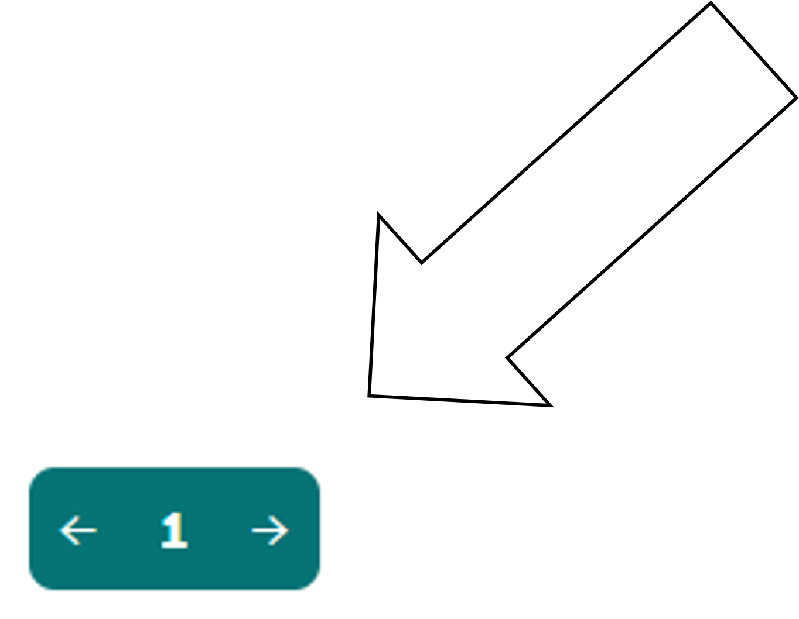

<!--
author:   Elias Wasmund

email:    elias.wasmund@hoffbauer-bildung.de

version:  0.0.1

language: de

narrator: DE Deutsch Female

comment:  Dieses LiaScript dient dazu Termvereinfachung nhand von Rechengesetzen mit einer 7. Klasse zu üben.


-->

# 0 - Übung Umformung von Termen
**Klicke unten auf den Pfeil neben der *1* nach Rechts, um eine Seite weiter zu kommen.**


## 0.1 - Einstieg
Herzlich Willkommen zu dieser Übungseinheit. Auf dieser Website wirst du sowohl wiederholende Inhalte finden, als auch Übungsaufgaben, welche du auch hier beantworten wirst. Das Tolle ist, dass dir auch angezeigt wird, ob dein Ergenis richtig war. 

Lass uns das Ganze doch gleich einmal ausprobieren.

---

**Gib** deinen Namen ein und klicke anschließend auf den Button "Abschicken":

[[___]]
<script>
  let name = `@input`
  alert("Herzlich Willkommen " + name + "! Viel Spaß beim Bearbeiten der Übung!");
</script>

Du solltest nun eine Begrüßungsnachricht mit deinem Namen erhalten haben. Das bedeutet, dass du die Eingabe erfolgreich übermittelt hast. 

---

Hier ein einfacher Test:

**Berechne** die folgende Rechenaufgabe und trage das Ergebnis ohne Leerzeichen in das Feld unten ein.

$32+7=?$

<!-- data-solution-button="off" -->
[[39]]
[[?]] Das Ergebnis ist größer als 38 und kleiner als 40 ;-) .
<script>
  if("@input"=="39") {
    alert("Richtig! Du hast die Aufgabe korrekt gelöst.");
    true;
  }
  else {
    alert("Leider falsch. Versuche es erneut.");
    false;}
</script>

In dieser Aufgabekonntest du sehen, dass es auch manchmal einen Hinweisbutton in Form einer Glühbirne geben kann. Nicht immer ist der Hinweis so offensichtlich wie in diesem Fall, aber er kann dir helfen, wenn du einmal nicht weiter weißt.

---

**Gehe nun der Reihenfolge nach die kommenden Sieten durch. Dort wirst du auch anderen Aufgabenformaten begegnen.**<!-- style="color: purple" -->

# 1 - Rechengesetz 1: *Zusammenfassen von Summen*
<div style="
  margin: 1em 0;
  border: 3px solid var(--lia-color-error, red);
  padding: 1em;
  border-radius: 8px;
  background: var(--lia-background-secondary);
  color: var(--lia-text-color);
">
Eine Summe gleicher Summanden $(+)$ lässt sich auch als Produkt $(\cdot)$ schreiben.

$a + a + a + a + a = 5 \cdot a = 5a$
</div>

Beispiele
=========

$  2 + 2 + 2 + 2 + 2 = 5 \cdot 2 = 10 $

$  x + x + x + x + x = 5 \cdot x = 5x $

$ a + a = 2 \cdot a = 2a$


Übungen
=======

Aufgabe 1.1: Neon-Klon
--------------------

>**Schreibe** die Summe als Produkt.
>
>$$q+q+q+q+q+q+q+q$$
>
> <!-- data-solution-button="off" -->
>[[8q]]
>[[?]] Zähle, wie oft $q$ vorkommt.
>[[?]] $q$ kommt achtmal vor.
<script>
let input = "@input".toLowerCase()
  .replace(/\s/g,"")
  .replace(/·/g,"")
  .replace(/\*/g,"");

["8q","q8"].includes(input);
</script>

--------------------------------------------------------

Aufgabe 1.2: Baustein-Booster
---------------------------

>**Fasse** die gleichen Summanden zusammen.
>
>$$4a+4a+4a+4a+4a$$
>
> <!-- data-solution-button="off" -->
>[[20a]]
>[[?]] Der gleiche Summand ist $4a$.
>[[?]] $4a$ kommt fünfmal vor.
<script>
let input = "@input".toLowerCase()
  .replace(/\s/g,"")
  .replace(/·/g,"")
  .replace(/\*/g,"");

["20a","a20"].includes(input);
</script>

---

Aufgabe 1.3: Fehler-Goblin
------------------------

>Der Fehler-Goblin behauptet:
>
>$$ m+m+m+m+m+m = m^6 $$
>
>**Gib** den richtigen vereinfachten Term ein.
>
> <!-- data-solution-button="off" -->
>[[6m]]
>[[?]] Achtung: Hier wird addiert, nicht multipliziert.
>[[?]] $m^6$ bedeutet $m \cdot m \cdot m \cdot m \cdot m \cdot m$.
>[[?]] Hier kommt $m$ sechsmal als Summand vor.
<script>
let input = "@input".toLowerCase()
  .replace(/\s/g,"")
  .replace(/·/g,"")
  .replace(/\*/g,"")
  .replace(/⁶/g,"^6");

["6m","m6"].includes(input);
</script>

---


# 2 - Rechengesetz 2: *Ordnen von Summanden*
<div style="
  margin: 1em 0;
  border: 3px solid var(--lia-color-error, red);
  padding: 1em;
  border-radius: 8px;
  background: var(--lia-background-secondary);
  color: var(--lia-text-color);
">
Mithilfe des Kommutativgesetzes (KG) lassen sich Summanden ordnen.


$\color{red}{a} + \color{blue}{b} + \color{red}{a} + \color{red}{a} + \color{blue}{b} = \color{red}{a} + \color{red}{a} + \color{red}{a} + \color{blue}{b} + \color{blue}{b} $

</div>

Beispiele
=========

$  x+y+x+y+x+x+x+y = x+x+x+x+x+y+y+y $

$  a+b+2a+b+a+b = a+2a+a+a+b+b+b $

$ m+m+n+k+m+n+k+l = m+m+m+n+n+k+k+l $


Übungen
=======

Aufgabe 2.1: Variablen-Tornado
----------------------------

>**Ordne** die Summanden und fasse zusammen.
>
>$$ p+q+r+p+q+p+r+q $$
>
> <!-- data-solution-button="off" -->
>[[3p+3q+2r]]
>[[?]] Sortiere zuerst gleiche Variablen nebeneinander.
>[[?]] Zähle dann: Wie oft kommt $p$, $q$ und $r$ vor?
>[[?]] $p$ kommt dreimal vor, $q$ kommt dreimal vor, $r$ kommt zweimal vor.
<script>
let input = "@input".toLowerCase()
  .replace(/\s/g,"")
  .replace(/·/g,"")
  .replace(/\*/g,"");

[
"3p+3q+2r",
"3p+2r+3q",
"3q+3p+2r",
"3q+2r+3p",
"2r+3p+3q",
"2r+3q+3p"
].includes(input);
</script>

---

Aufgabe 2.2: Monster-Sortiermaschine
------------------------------------

>Die Monster-Sortiermaschine bringt gleiche Variablen zusammen.
>
>**Vereinfache** den Term.
>
>$$ 2a+b+3c+a+4b+2c $$
>
> <!-- data-solution-button="off" -->
>[[3a+5b+5c]]
>[[?]] Sortiere zuerst nach $a$, $b$ und $c$.
>[[?]] $2a+a=3a$
>[[?]] $b+4b=5b$, $3c+2c=5c$
<script>
let input = "@input".toLowerCase()
  .replace(/\s/g,"")
  .replace(/·/g,"")
  .replace(/\*/g,"");

[
"3a+5b+5c",
"3a+5c+5b",
"5b+3a+5c",
"5b+5c+3a",
"5c+3a+5b",
"5c+5b+3a"
].includes(input);
</script>

---

Aufgabe 2.3: Kassenbon-Chaos
--------------------------

>Auf dem Kassenbon stehen Variablen durcheinander.
>
>**Fasse** zusammen.
>
>$$ 5x+2y+x+3z+4y+2x+z $$
>
> <!-- data-solution-button="off" -->
>[[8x+6y+4z]]
>[[?]] Sammle zuerst alle $x$-Terme.
>[[?]] Danach sammelst du alle $y$-Terme und $z$-Terme.
>[[?]] $5x+x+2x=8x$
<script>
let input = "@input".toLowerCase()
  .replace(/\s/g,"")
  .replace(/·/g,"")
  .replace(/\*/g,"");

[
"8x+6y+4z",
"8x+4z+6y",
"6y+8x+4z",
"6y+4z+8x",
"4z+8x+6y",
"4z+6y+8x"
].includes(input);
</script>

---

## 2.1 - Kombination von Rechengesetz 1 und 2
Die Rechengesetze 1 und 2 lassen sich wunderbar kombinieren, sodass nach dem Umsortieren der Summanden nach Rechengesetz 2 auch die Vereinfachung durch Zusammenfassung nach Rechengesetz 1 möglich ist.

Beispiele
=========

$$
6a-4a = (6-4)a = 2a
$$

$$
-5b-8b = (-5-8)b = -13b
$$

Übugen
======

Aufgabe 2.1.1: Minus-Mine
-------------------------

>**Fasse** die gleichartigen Terme zusammen.
>
>$$ 14t-6t+3t-8t $$
>
> <!-- data-solution-button="off" -->
>[[3t]]
>[[?]] Rechne nur mit den Zahlen vor dem $t$.
>[[?]] $14-6+3-8=3$
>[[?]] Also bleibt $3t$.
<script>
let input = "@input".toLowerCase()
  .replace(/\s/g,"")
  .replace(/·/g,"")
  .replace(/\*/g,"");

["3t","t3"].includes(input);
</script>

---

Aufgabe 2.1.2: Thermometer-Term
-------------------------------

>**Vereinfache** den folgenden Term.
>
>$$ -5a+12a-3a-7a $$
>
> <!-- data-solution-button="off" -->
>[[-3a]]
>[[?]] Achte genau auf die Vorzeichen.
>[[?]] $(-5+12-3-7=-3)$
>[[?]] Also lautet der Term $(-3a)$ .
<script>
let input = "@input".toLowerCase()
  .replace(/\s/g,"")
  .replace(/·/g,"")
  .replace(/\*/g,"");

["-3a"].includes(input);
</script>

---

Aufgabe 2.1.3: Pyramiden-Code der Drachenburg
---------------------------------------------

>Bei einer Term-Pyramide entsteht jeder obere Stein aus der Summe der beiden
>darunterliegenden Steine.
>
>**Ergänze die fehlenden Steine**. Gib die Antworten ohne Mal-Zeichen ein.
>
> <!-- data-show-partial-solution
       data-solution-button="off" -->
>``` ascii
>                              +---------------+
>                              |  " [[ 4x ]] " |
>                              +---------------+
>                                 /         \
>                                /           \
>                               /             \
>
>                 +---------------+       +---------------+
>                 | " [[ x ]] "   |       | " [[ 3x ]] "  |
>                 +---------------+       +---------------+
>                    /         \             /         \
>                   /           \           /           \
>                  /             \         /             \
>
>      +---------------+   +---------------+   +---------------+
>      |      3x       |   |      -2x      |   |      5x       |
>      +---------------+   +---------------+   +---------------+
>```
>[[?]] Jeder obere Stein entsteht aus der Summe der zwei Steine direkt darunter.
>[[?]] Links in der Mitte gilt: $3x+(-2x)$.
>[[?]] Rechts in der Mitte gilt: $-2x+5x$.
>[[?]] Ganz oben addierst du die beiden mittleren Steine.

---


# 3 - Rechengesetz 3: *Produkte von Zahlen und Variablen*
<div style="
  margin: 1em 0;
  border: 3px solid var(--lia-color-error, red);
  padding: 1em;
  border-radius: 8px;
  background: var(--lia-background-secondary);
  color: var(--lia-text-color);
">
Ein **Produkt** aus Termen mit Zahlen und Variablen wird vereinfacht, indem man Zahlen mit Zahlen und Variablen mit Variablen multipliziert.

$3x \cdot 4y = 3 \cdot x \cdot 4 \cdot y \xrightarrow{\text{Kommutativgesetz}} 3 \cdot 4 \cdot x \cdot y \xrightarrow{\text{Assoziativgesetz}} (3 \cdot 4) \cdot (x \cdot y) = 12xy$

Falls du dir mit dem Kommutativgesetz und dem Assoziativgesetz nicht mehr so sicher bist, kannst du hier noch einmal nachlesen, was diese Gesetze besagen: https://www.gut-erklaert.de/mathematik/rechengesetze-mathe.html

</div>

Beispiele
=========

$ 2a \cdot 5b = 10ab$

$ 10\cdot 3 \cdot j \cdot 4 \cdot k = 120jk$

Übungen
=======

Aufgabe 3.1: Faktor-Fabrik 3000
-------------------------------

>Die Faktor-Fabrik sortiert zuerst Zahlen und Variablen.
>
>**Vereinfache** den Term vollständig.
>
>$$ -2a \cdot 3b \cdot 5c $$
>
> <!-- data-solution-button="off" -->
>[[-30abc]]
>[[?]] Multipliziere zuerst die Zahlen.
>[[?]] $-2 \cdot 3 \cdot 5=-30$
>[[?]] Danach multiplizierst du die Variablen a, b und c.
<script>
let input = "@input".toLowerCase()
  .replace(/\s/g,"")
  .replace(/·/g,"")
  .replace(/\*/g,"");

[
"-30abc",
"-30acb",
"-30bac",
"-30bca",
"-30cab",
"-30cba"
].includes(input);
</script>

------------------------------------------

Aufgabe 3.2: Roboter sortiert falsch
------------------------------------

>Ein Roboter schreibt:
>
>$$ 4x \cdot 7y = 11xy $$
>
>**Gib** den richtigen vereinfachten Term ein.
>
> <!-- data-solution-button="off" -->
>[[28xy]]
>[[?]] Der Roboter hat die Zahlen addiert. Das ist hier falsch.
>[[?]] Bei einem Produkt musst du die Zahlen multiplizieren.
>[[?]] $4 \cdot 7 = 28$
<script>
let input = "@input".toLowerCase()
  .replace(/\s/g,"")
  .replace(/·/g,"*")
  .replace(/\*/g,"");

["28xy","28yx"].includes(input);
</script>

---

Aufgabe 3.3: Sternaufgabe
-------------------------

>Der Wert in einem äußeren Feld entsteht aus dem Produkt der beiden angrenzenden
>inneren Felder.
>
>**Ergänze** die äußeren Felder direkt im Stern.
>
> <!-- data-show-partial-solution
       data-solution-button="off" -->
>``` ascii
>                              +---------------+
>                              | " [[ 6xy ]] " |
>                              +---------------+
>                                 /         \
>                                /           \
>                               /             \
>
>                    +---------+               +---------+
>                    |   2x    |---------------|   3y    |
>                    +---------+               +---------+
>                       /                             \
>                      /                               \
>                     /                                 \
>
>      +---------------+                               +----------------+
>      | " [[ 8ax ]] " |                               | " [[ 15by ]] " |
>      +---------------+                               +----------------+
>
>                     \                                 /
>                      \                               /
>                       \                             /
>                    +---------+               +---------+
>                    |   4a    |---------------|   5b    |
>                    +---------+               +---------+
>
>                               \             /
>                                \           /
>                                 \         /
>                              +----------------+
>                              | " [[ 20ab ]] " |
>                              +----------------+
>```
>[[?]] Multipliziere immer die beiden angrenzenden inneren Felder.
>[[?]] Oben: $2x \cdot 3y$
>[[?]] Rechts: $3y \cdot 5b$
>[[?]] Unten: $4a \cdot 5b$
>[[?]] Links: $2x \cdot 4a$


# 4 - Rechengesetz 4: *Produkte von Zahlen und Variablen*
<div style="
  margin: 1em 0;
  border: 3px solid var(--lia-color-error, red);
  padding: 1em;
  border-radius: 8px;
  background: var(--lia-background-secondary);
  color: var(--lia-text-color);
">
Bei Multiplikation $(\cdot)$ gleicher Variablen, können diese zu Potenzen zusammengefasst werden. Dabei entspricht der wert der Potenz, als die hochgestellt Zahl, der Anzahl der gleichen Variablen, die miteinander multipliziert werden.

$3x \cdot x = 3 \cdot x \cdot x \xrightarrow{Assoziativgesetz} 3 \cdot (x \cdot x)= 3x²$

Hinweis: Dividiert $(:)$ man einen Term durch eine Zahl, dividiert man nur die Zahlen.

</div>

Beispiele
=========

$ a \cdot a = a² $ oder $a \cdot a \cdot a \cdot a \cdot a = a⁵ $

$ 2a \cdot 3a = 6a²$

$\frac{6a^2}{2}=3a^2$

Übungen
=======

Aufgabe 4.1: Potenz-Detektiv
----------------------------

>**Vereinfache** den Term.
>
>$$ 7m \cdot m $$
>
> <!-- data-solution-button="off" -->
>[[7m^2]]
>[[?]] Die Zahl $7$ bleibt vorne stehen.
>[[?]] $m \cdot m$ schreibt man als $m^2$.
<script>
let input = "@input".toLowerCase()
  .replace(/\s/g,"")
  .replace(/·/g,"*")
  .replace(/\*/g,"")
  .replace(/²/g,"^2");

["7m^2"].includes(input);
</script>

---


Aufgabe 4.2: Variable stapeln
-----------------------------

>**Vereinfache** den Term.
>
>$$ 2x \cdot x \cdot x $$
>
> <!-- data-solution-button="off" -->
>[[2x^3]]
>[[?]] Zähle, wie oft $x$ als Faktor vorkommt.
>[[?]] $x \cdot x \cdot x = x^3$
>[[?]] Die Zahl $2$ bleibt vor der Potenz stehen.
<script>
let input = "@input".toLowerCase()
  .replace(/\s/g,"")
  .replace(/·/g,"*")
  .replace(/\*/g,"")
  .replace(/³/g,"^3");

["2x^3"].includes(input);
</script>

---

Aufgabe 14.3: Term-Fahrstuhl
---------------------------

>Der Term fährt durch den Divisions-Fahrstuhl.
>
>**Vereinfache** den folgenden Term.
>
>$$ 36a : 6 $$
>
> <!-- data-solution-button="off" -->
>[[6a]]
>[[?]] Dividiere nur die Zahl vor der Variable.
>[[?]] $36 : 6 = 6$
>[[?]] Die Variable $a$ bleibt erhalten.
<script>
let input = "@input".toLowerCase()
  .replace(/\s/g,"")
  .replace(/·/g,"*")
  .replace(/\*/g,"");

["6a","a6"].includes(input);
</script>